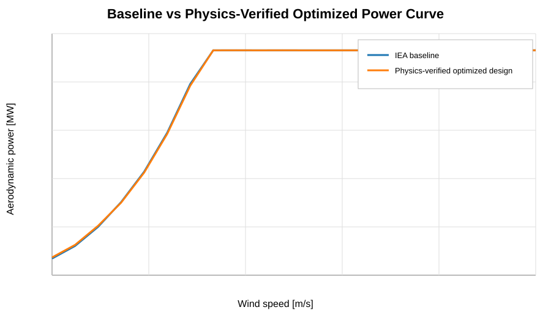
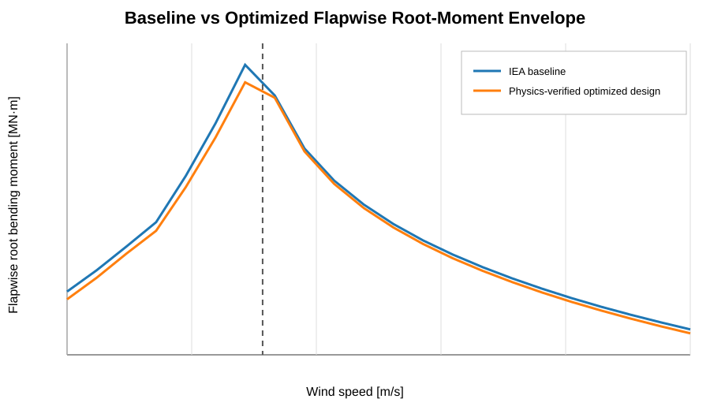
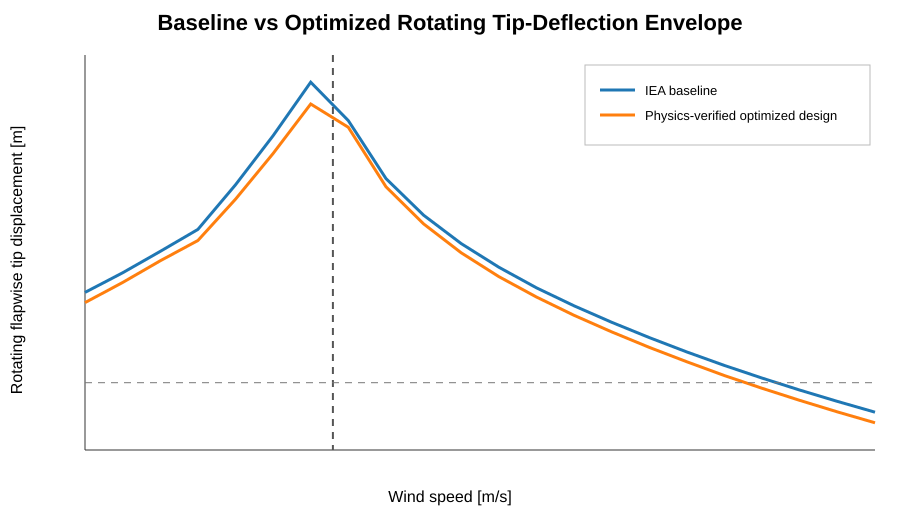
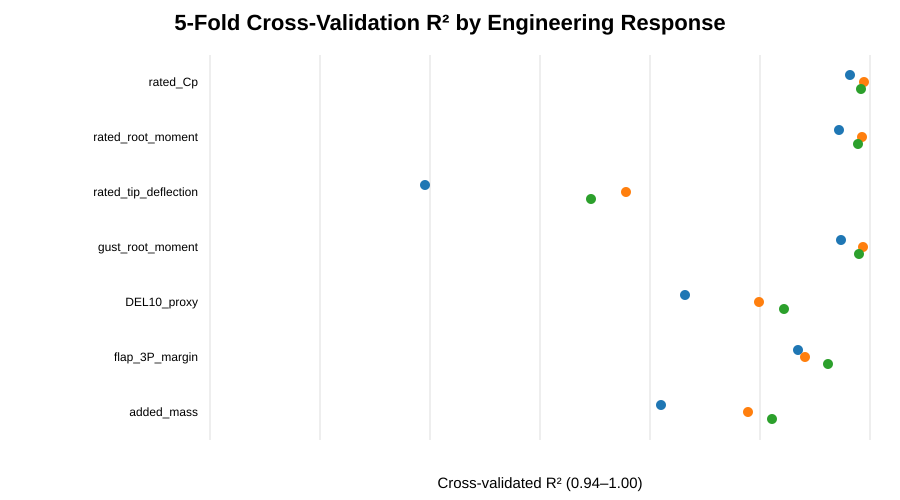

# AeroStruct-15MW

## Physics-Based Aero-Structural Optimization of a 15-MW Offshore Wind Turbine Blade with Machine-Learning Surrogates

[](https://github.com/shreyas-chandhavar/AeroStruct-15MW/actions/workflows/tests.yml)


**Project status:** technical development complete; repository packaged for reproducible public review.

**Quick links:** [Methodology](docs/methodology.md) · [Validation](docs/model_validation.md) · [ML workflow](docs/ml_surrogate_workflow.md) · [Results](docs/results.md) · [Assumptions & limitations](docs/assumptions_and_limitations.md) · [Reproducibility](docs/reproducibility.md) · [References](docs/references.md)

AeroStruct-15MW is an independent reduced-order engineering study built around the public **IEA 15-MW offshore reference turbine**. The project combines:

- Blade Element Momentum (BEM) aerodynamics
- Prandtl hub/tip losses and a Buhl-type high-induction correction
- steady variable-speed and pitch-controlled operation
- Euler-Bernoulli blade mechanics and a rotating-beam FEM
- centrifugal stiffening
- simplified gust, gravity, fatigue-proxy and modal analyses
- Latin Hypercube design-of-experiments
- Random Forest, Extra Trees and Gradient Boosting surrogate models
- multi-objective Pareto search
- full reduced-order physics re-verification of surrogate-selected designs

The purpose is not to claim a certified redesign of the IEA turbine. It is to demonstrate a reproducible **model → validate → explore → optimize → ML-accelerate → physics-reverify** workflow for offshore-wind blade load alleviation.

---

## Key result

The final balanced, physics-verified candidate was dominated by a smooth aerodynamic twist modification rather than structural reinforcement:

| Design variable | Final value |
|---|---:|
| Peak smooth outboard twist | **1.499°** |
| Aerodynamic modification start | **76.91 m** from blade root |
| Structural modification start | 81.86 m |
| Local flapwise EI increase | **0.061%** |
| Added structural mass | **≈2.01 kg/blade** |

The structural variables remain listed because they were part of the four-variable optimization space; their near-zero optimum is itself an engineering conclusion.

### Physics-verified performance

| Metric | Baseline | Final candidate | Change |
|---|---:|---:|---:|
| Rated power coefficient, \(C_P\) | 0.49241 | 0.48752 | **−0.99%** |
| Rated flapwise root moment | 63.108 MN·m | 59.543 MN·m | **−5.65%** |
| Rated rotating tip deflection | 15.570 m | 14.444 m | **−7.23%** |
| Simplified +20% frozen-control gust root moment | 75.169 MN·m | 71.419 MN·m | **−4.99%** |
| DEL10 fatigue proxy | 16.3883 MN·m | 16.3899 MN·m | **+0.01%** |
| Aerodynamic AEP proxy | 75.863 GWh/y | 75.803 GWh/y | **−0.078%** |

These values are outputs of the reduced-order models documented in this repository; they are **not IEC design-load certification results**.

---

## Final controlled operating envelope



The final design preserves the controlled aerodynamic power curve closely while changing the outboard loading distribution.



Across the sampled 4–25 m/s controlled envelope, the optimized root moment remained below the baseline at every evaluated point. The reduction ranged from roughly **0.83% to 9.49%** depending on operating condition.



The maximum sampled deflection magnitude was reduced by approximately **7.24%** near the critical below-rated region. At 22–25 m/s, both models enter a load-reversal regime and the optimized blade has a somewhat larger negative deflection magnitude; this trade-off is retained explicitly rather than hidden.

---

## Baseline validation

The BEM baseline was checked against selected public IEA reference design-point values before optimization:

| Quantity | Reference | Model | Difference |
|---|---:|---:|---:|
| \(C_P\) | 0.489 | 0.4924 | ≈0.70% |
| \(C_T\) | 0.799 | 0.8021 | ≈0.39% |
| Aerodynamic power | 16.092 MW | 16.204 MW | ≈0.70% |

A separate structural numerical check compared curvature integration with the non-rotating FEM:

- integration-method tip deflection: **17.0701 m**
- FEM tip deflection: **17.0427 m**
- difference: **≈−0.16%**

See [`docs/model_validation.md`](docs/model_validation.md).

---

## Engineering workflow

```text
IEA 15-MW public reference data
            │
            ▼
  Geometry + structural data + polars
            │
            ▼
    Independent BEM implementation
  Prandtl losses + high-induction correction
            │
            ▼
     Baseline Cp / Ct / power validation
            │
            ▼
        Distributed blade loading
            │
            ▼
  Beam integration → rotating beam FEM
       + centrifugal stiffening
            │
            ▼
 Gust + gravity + fatigue proxy + modes
            │
            ▼
  Four-variable AeroStruct design model
            │
            ▼
  300-point Latin Hypercube physics DOE
            │
            ▼
  RF / Extra Trees / Gradient Boosting
       + holdout + 5-fold CV
            │
            ▼
      100,000-design surrogate search
            │
            ▼
     Engineering constraints + Pareto
            │
            ▼
  152 surrogate core Pareto candidates
            │
            ▼
   Full reduced-order physics re-check
            │
            ▼
102 feasible → 54 physics Pareto designs
            │
            ▼
17 designs with ≤1% DEL-proxy penalty
            │
            ▼
     Equal-weight utopia selection
            │
            ▼
   Final physics-verified candidate
            │
            ▼
  4–25 m/s final envelope verification
```

Full methodology: [`docs/methodology.md`](docs/methodology.md).

---

## Why machine learning is used

ML does **not** replace the physical solver in this project. The reduced-order physics model generates the training database, and tree-based regression models approximate that mapping to search a much larger design space cheaply.

- physics DOE: **300 designs**
- train/test split: **240 / 60**
- models: Random Forest, Extra Trees, Gradient Boosting
- validation: independent holdout + **5-fold cross-validation**
- surrogate screening: **100,000 designs**
- final Pareto points were re-run through the physics evaluator



The final design is therefore described as **surrogate-assisted and physics-verified**, not as an unconstrained AI-generated design.

More detail: [`docs/ml_surrogate_workflow.md`](docs/ml_surrogate_workflow.md).

---

## Engineering evidence and traceability

The repository keeps the final plots compact and readable, while the detailed derivations, checks, assumptions and intermediate design decisions are documented in:

- [`docs/methodology.md`](docs/methodology.md) — end-to-end engineering methodology;
- [`docs/model_validation.md`](docs/model_validation.md) — aerodynamic and structural numerical checks;
- [`docs/ml_surrogate_workflow.md`](docs/ml_surrogate_workflow.md) — DOE, surrogate validation, large search and physics re-verification;
- [`docs/assumptions_and_limitations.md`](docs/assumptions_and_limitations.md) — scope boundaries and known trade-offs;
- [`docs/reproducibility.md`](docs/reproducibility.md) — exact reproduction sequence and expected checkpoints;
- [`docs/references.md`](docs/references.md) — upstream data and literature references;
- [`results/tables/`](results/tables/) — machine-readable final metrics and operating-envelope data;
- [`notebooks/01_end_to_end_workflow.ipynb`](notebooks/01_end_to_end_workflow.ipynb) — cleaned public reproduction notebook.

---

## Engineering capabilities demonstrated

This repository is designed to make the technical work inspectable, not just to show final plots. It demonstrates:

- aerodynamic model development and validation using BEM;
- spanwise load integration and rotating-beam finite-element modelling;
- centrifugal geometric stiffening and reduced-order modal analysis;
- engineering trade-space exploration with explicit constraints;
- fatigue-, gust-, energy- and modal-aware design screening;
- physics-generated design-of-experiments and surrogate modelling;
- holdout testing, five-fold cross-validation and feature-importance interpretation;
- large-scale surrogate search followed by full physics re-verification;
- reproducible Python packaging, tests and CI.

---

## Repository structure

```text
AeroStruct-15MW/
├── README.md
├── LICENSE
├── NOTICE
├── pyproject.toml
├── requirements.txt
├── src/aerostruct15mw/
│   ├── bem.py               # BEM station + rotor integration
│   ├── control.py           # rpm schedule + above-rated pitch bisection
│   ├── structures.py        # integration, rotating FEM, modes
│   ├── design.py            # smooth twist + EI/mass design parameterization
│   ├── physics.py           # unified candidate evaluator
│   ├── ml.py                # DOE + surrogate training/CV
│   ├── pareto.py            # engineering constraints + Pareto + utopia selection
│   ├── aep.py               # Weibull/AEP and cycle-count helpers
│   ├── io.py                # AeroDyn / ElastoDyn parsing
│   └── plotting.py
├── scripts/
│   ├── fetch_reference_data.py
│   ├── run_baseline.py
│   ├── run_final_candidate.py
│   └── run_ml_pipeline.py
├── notebooks/
│   ├── README.md
│   └── 01_end_to_end_workflow.ipynb
├── data/
│   ├── reference/           # downloaded upstream files; not committed by default
│   └── processed/           # generated geometry/structural CSVs
├── results/
│   ├── figures/
│   └── tables/
├── docs/
└── tests/
```

The cleaned notebook and modular `src/` package are the authoritative public implementation. The large exploratory Colab development notebook is intentionally kept out of the main branch so visitors see a readable, reproducible engineering workflow rather than thousands of experimental cells.

---

## Reproduce the project

### 1. Create an environment

```bash
python -m venv .venv
source .venv/bin/activate     # Windows: .venv\Scripts\activate
python -m pip install --upgrade pip
pip install -e .
```

### 2. Fetch the public IEA reference inputs

```bash
python scripts/fetch_reference_data.py
```

This downloads the required IEA blade geometry, ElastoDyn structural properties, AeroDyn polars and upstream license from the official IEA Wind Systems repository, then creates the processed CSV files used here.

### 3. Reproduce the baseline

```bash
python scripts/run_baseline.py
```

### 4. Recompute the final candidate and controlled envelope

```bash
python scripts/run_final_candidate.py
```

### 5. Re-run the ML workflow

```bash
python scripts/run_ml_pipeline.py
```

Full physics verification of the surrogate Pareto candidates is intentionally opt-in because it takes longer:

```bash
python scripts/run_ml_pipeline.py --verify-pareto
```

---

## Reference data and attribution

This repository's analysis code, optimization workflow and generated results are separate from the public IEA 15-MW reference inputs.

Reference inputs are fetched from:

- IEA Wind Systems, **IEA-15-240-RWT**: https://github.com/IEAWindSystems/IEA-15-240-RWT
- Gaertner et al., *Definition of the IEA 15-Megawatt Offshore Reference Wind Turbine*, NREL/TP-5000-75698, 2020.

The upstream repository currently provides its data under the Apache License 2.0. The fetch script stores the upstream license with the downloaded files. See [`data/README.md`](data/README.md) and [`NOTICE`](NOTICE).

---

## Assumptions and limitations

The final results should be interpreted within the study assumptions. Important limitations include:

- steady BEM rather than time-domain aeroelastic CFD/OpenFAST
- quasi-steady 2D airfoil polar interpolation
- no dynamic stall, yaw, shear, tower shadow or turbulence realization
- Euler-Bernoulli blade representation; no torsion, shear deformation or bend-twist coupling
- simplified proportional mass-to-EI structural proxy
- steady rpm/pitch controller rather than actuator/control-system dynamics
- simplified +20% frozen-control gust, not an IEC DLC
- DEL-style gravity fatigue proxy, not rainflow-counted IEC fatigue
- no detailed composite laminate, buckling or failure-index design
- aerodynamic AEP proxy rather than bankable electrical AEP
- no full OpenFAST/IEC/experimental certification

See [`docs/assumptions_and_limitations.md`](docs/assumptions_and_limitations.md).

---

## Main engineering conclusion

Within the bounded reduced-order design space, the optimization moved toward **aerodynamic load redistribution rather than additional structural material**. Approximately 1.5° of smooth outboard twist produced a useful reduction in flapwise root loading and critical rotating deflection while the final structural reinforcement collapsed to a negligible value.

The defensible conclusion is therefore not “the IEA 15-MW turbine has been improved.” It is:

> A reduced-order, physics-verified design hypothesis was identified that improves selected modeled load and deflection metrics relative to the IEA reference baseline under the assumptions of this study, with a small aerodynamic-performance penalty. Higher-fidelity aeroelastic, structural and IEC load-case validation is required before any practical design claim.

---

## Suggested GitHub topics

`offshore-wind` · `wind-energy` · `aerodynamics` · `BEM` · `finite-element-method` · `machine-learning` · `surrogate-model` · `multi-objective-optimization` · `python` · `renewable-energy`
